# LuckLotter — AI Retention Layer

**Demo walkthrough and design notes.** Phase 1 MVP, verified against the running
stack on 18 August 2026.

This document is written to be read in two ways. Follow the **Demo script**
top-to-bottom while driving the app, and hand the **Design decisions** and
**Edge cases** sections to a reviewer who wants to know why it behaves the way
it does. Every screenshot here is the real application against seeded data —
none of it is a mockup.

---

## 1. What the product does

A café keeps a customer's transactions in its till system and never looks at
them again. LuckLotter reads that same POS data and answers one question the
till cannot: *which of my regulars have quietly stopped coming?*

The engine does three things, in order:

1. **Learns** each customer's own visit rhythm from their transaction history.
2. **Flags** a customer when they go quiet *relative to that rhythm* — not
   against a fixed number of days.
3. **Generates and sends** a win-back offer, carrying a redemption code, and
   closes the flag by itself when the customer comes back.

The whole point is the word *own*. A daily regular missing for two weeks and a
monthly regular missing for two weeks are not the same event, and a single
"inactive after 30 days" setting cannot tell them apart.

### The trigger, in one line

```
flag when  days_since_last_visit
             > clamp(avg_interval_days × sensitivity_multiplier,
                     min_threshold_days, max_threshold_days)
```

`avg_interval_days` is the customer's learned cadence. The multiplier and the
two clamps are the only things the business tunes. Both the threshold and the
cadence are **snapshotted onto each flag**, so a flag stays explainable after
the business later retunes its settings.

### Stack

| Layer | Choice |
|---|---|
| Backend | Spring Boot 3.3 / Java 21, Postgres 16, Flyway, JWT |
| Frontend | Angular 19 standalone components, served by nginx |
| Mail | SMTP, caught by a Mailpit container in the demo |
| Infra | Docker Compose; Coolify on a single VPS as the deploy target |

---

## 2. Running the demo

Docker is the only prerequisite — no local JDK, Maven, or Node.

```bash
cp .env.example .env          # set SEED_ENABLED=true before the first start
docker compose up --build
```

| | |
|---|---|
| Dashboard | <http://localhost:4200> |
| API | <http://localhost:8080> |
| Offer inbox (Mailpit) | <http://localhost:8025> |

Sign in with `SEED_ADMIN_EMAIL` / `SEED_ADMIN_PASSWORD` (defaults
`admin@lucklotter.test` / `demo-password-123`).

The seed creates one business — **Kaldi's Coffee House** — and a set of
customers whose visit histories are built to exercise every path: customers who
should flag, customers still on cadence, customers with no contact details, and
customers with too little history to judge. Seeding is skipped entirely if any
business already exists, so it can never touch real data.

> **Two things to know before you present.** Offer emails are *really sent* over
> SMTP — the template, the transport, the status transitions and the failure-code
> mapping all execute. They are caught by Mailpit, so nothing can reach an actual
> person, which is what makes it safe to point at seeded customers. And nginx
> proxies `/v1` from port 4200, so the browser only ever talks to one origin and
> the API needs no CORS configuration anywhere.

---

## 3. Demo script

Seven steps. Each one names what to say and what it actually proves.

### Step 1 — Sign in

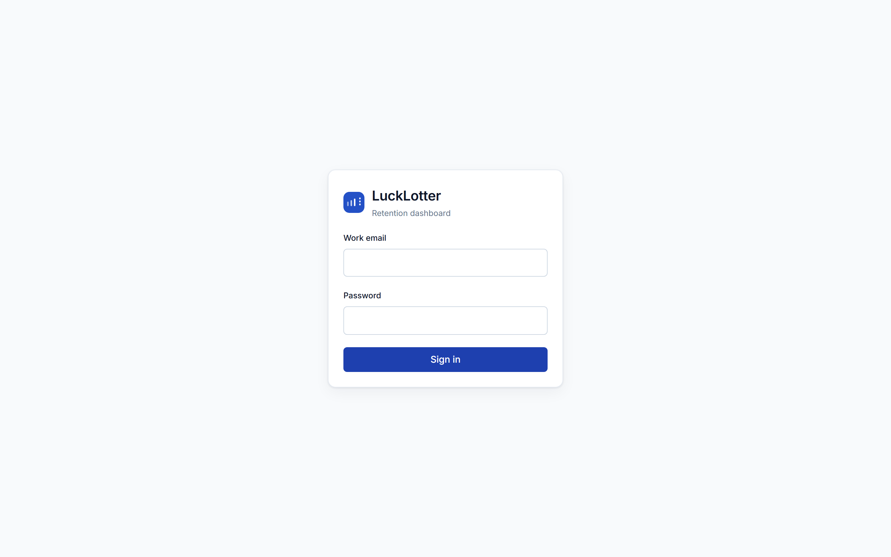

Everything except login and `/actuator/health` sits behind the JWT filter —
`SecurityConfig` is `anyRequest().authenticated()`, not a list of protected
paths, so a new endpoint is private by default rather than public by accident.

`JWT_SECRET` comes from the environment with **no fallback in committed
config**: a misconfigured deploy fails to boot rather than starting up signing
tokens with a default everyone can read.

---

### Step 2 — Overview: is this working?

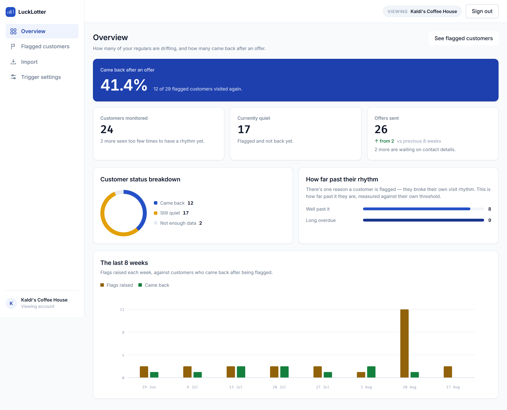

**Say:** "This is the number the owner cares about — of everyone we flagged, how
many actually came back."

Every figure on this page is a real aggregate from a single endpoint
(`GET /v1/stats/overview`); nothing is reconstructed in the browser. Worth
pointing at:

- **Came back after an offer** — the headline recovery rate, with the raw
  fraction beside it so a small denominator can't hide behind a percentage.
- **Customers monitored** names, separately, how many were *seen too few times
  to have a rhythm yet*. Those customers are not failures and not flaggable —
  hiding them would overstate coverage.
- **How far past their rhythm** buckets the open flags by how badly the rhythm
  was broken. This is the panel that tells an owner whether sensitivity is set
  usefully.
- **The last 8 weeks** puts flags raised against customers who came back, so the
  two series can be read against each other rather than in separate charts.

---

### Step 3 — The flag list: the evidence, per row

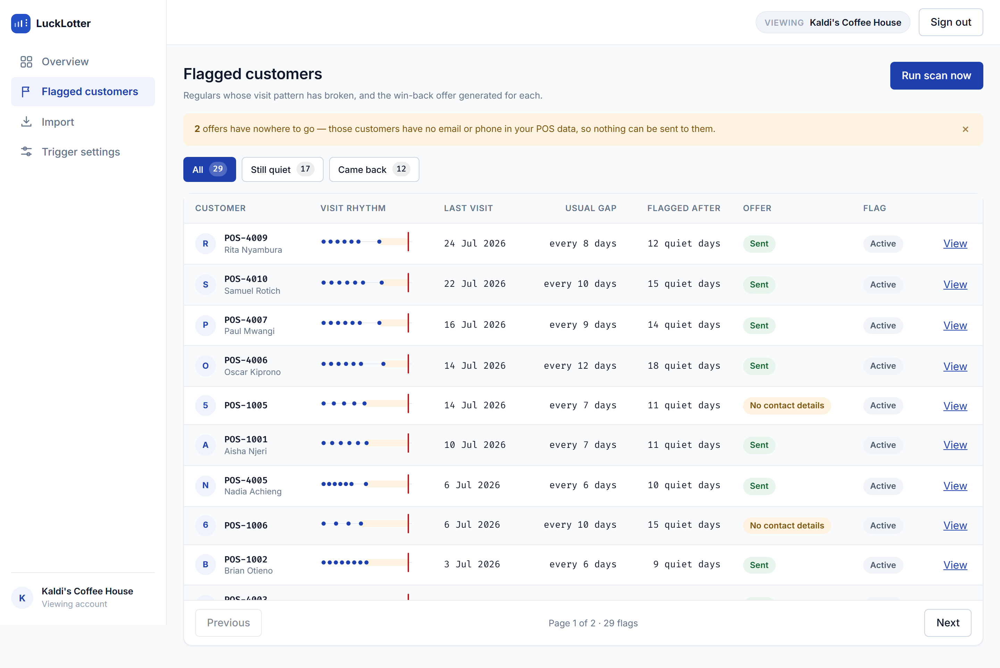

**Say:** "Each row carries its own evidence. You never have to trust the flag —
the reason is on the row."

- The **visit rhythm** sparkline draws real recorded visits, the quiet stretch,
  and the moment the flag was raised. Twelve visits maximum, so a row stays a
  row.
- **Usual gap** and **quiet days** are the two numbers the trigger compared.
- The **amber banner** counts customers who were flagged but have no email or
  phone. That gap is deliberately visible — see [Edge case 3](#3-a-customer-with-no-contact-details).
- The filters (**All / Still quiet / Came back**) are counts, not just labels.

Press **Run scan now**, then press it again. The second run flags nobody. That
is not the loop being careful — it is a partial unique index in Postgres
enforcing at most one open flag per customer. See
[Edge case 5](#5-two-scans-running-at-once).

---

### Step 4 — One flag in full

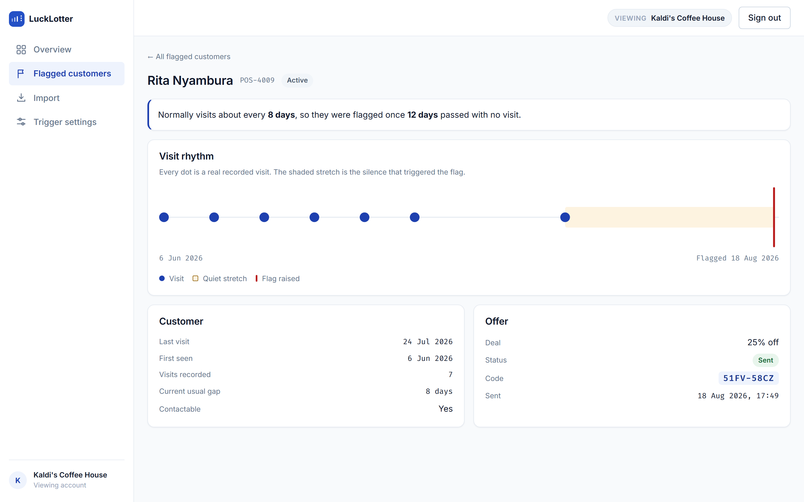

**Say:** "This is the page that has to survive an owner asking *why did you
email my customer?*"

It answers in plain language first — *normally visits about every 8 days, so
they were flagged once 12 days passed with no visit* — and then shows the
timeline as visual evidence for those same two numbers. The offer, its delivery
state, and the redemption code the customer quotes at the counter sit
underneath.

The customer's name leads and the till reference sits beside it, because the
reference is what the owner can actually look up in their own system.

**…and the same page once they come back:**

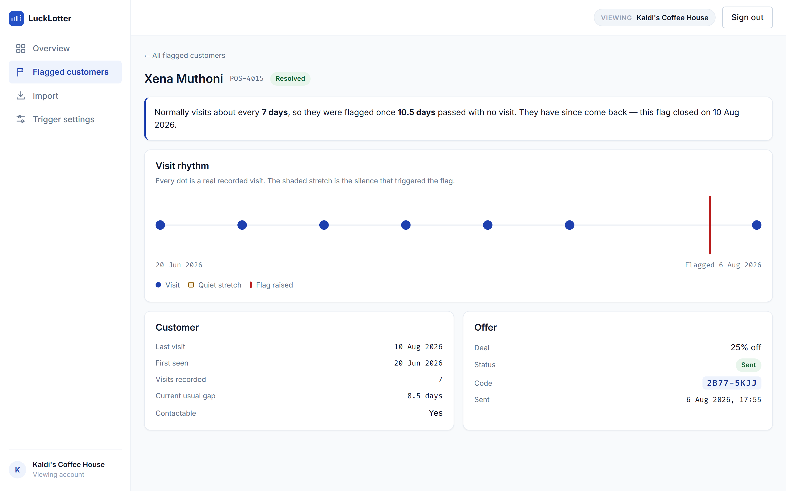

Note the last dot, sitting to the *right* of the flag marker — that is the
return visit, and it closed the flag by itself. The explanation gains one
sentence rather than changing into a different page. Nobody clicked anything:
the flag was answered by a transaction arriving from the till.

The **Came back** filter on the list is the same set, counted:

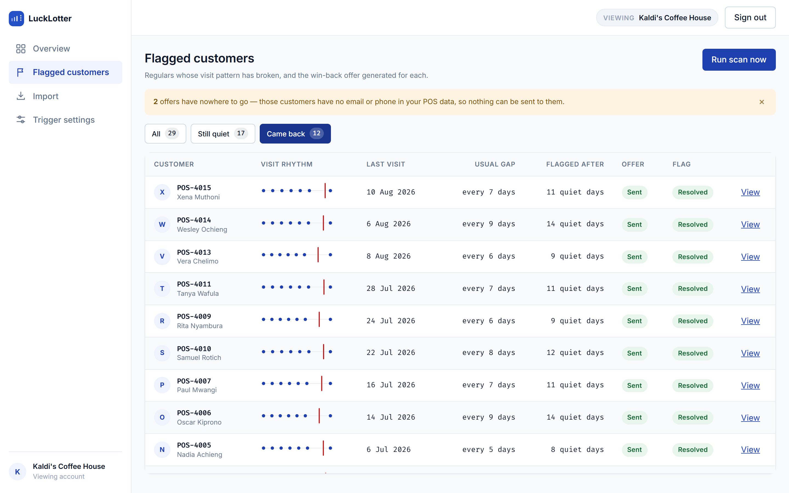

---

### Step 5 — The offer that was really sent

Open <http://localhost:8025> — the Mailpit inbox catching everything the app
sends:

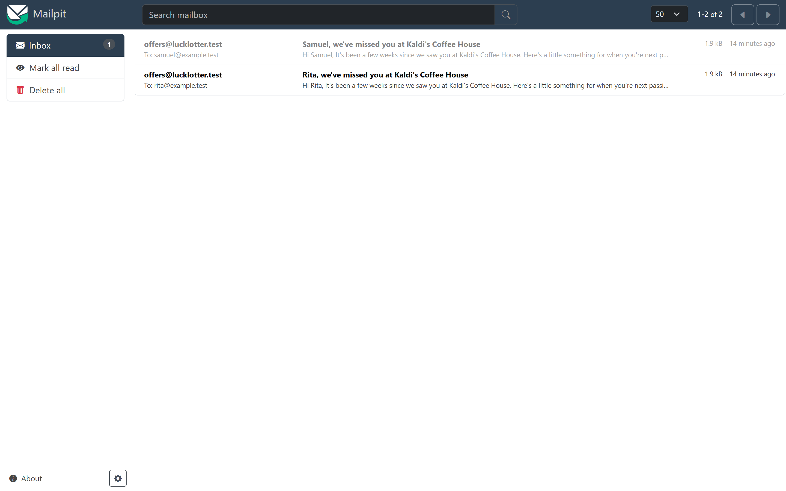

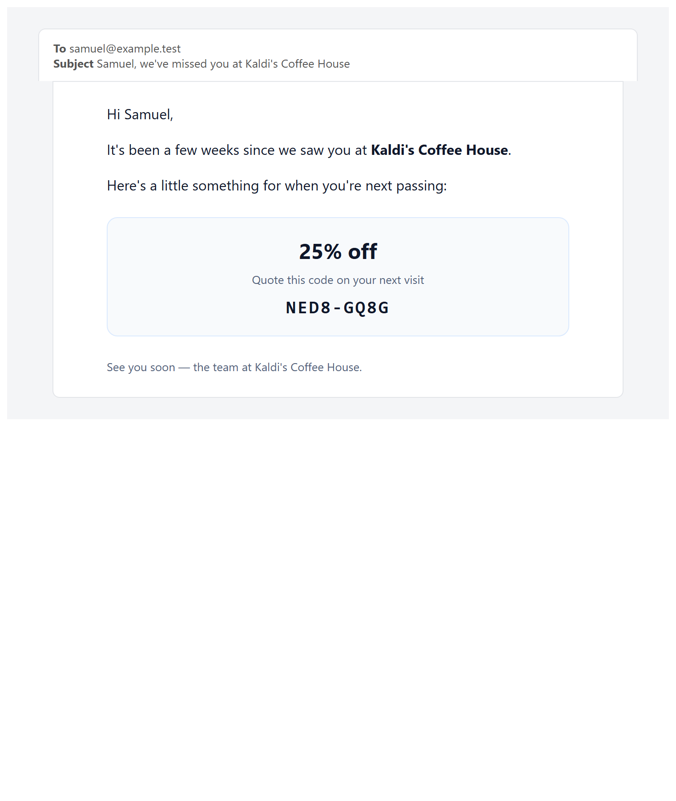

The email is addressed by name, names the
business, and carries the same redemption code shown on the flag detail page.
Where the POS supplied a "usual order", the copy uses it; where it didn't, the
sentence simply omits it rather than printing an empty slot.

---

### Step 6 — Tuning the trigger

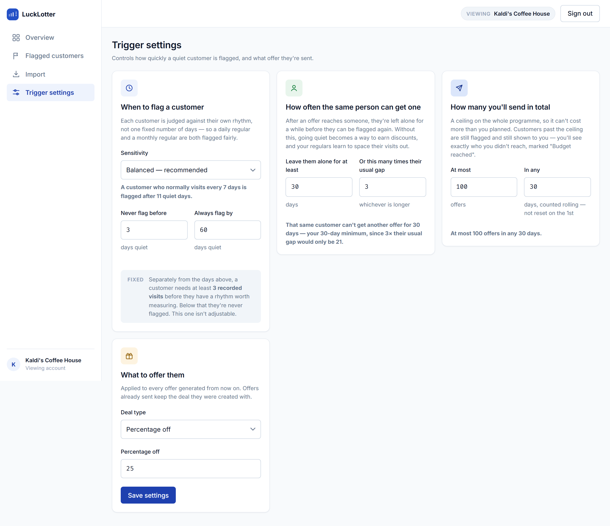

**Say:** "The owner never sees the multiplier. They see what it does."

Sensitivity is presented as named choices with a **worked example that updates
live** — *"a customer who normally visits every 7 days is flagged after 11 quiet
days"* — because `1.5` means nothing to a café owner. The same treatment is
applied to the cooldown and the budget ceiling: each card states, in a sentence,
what the numbers currently in the boxes will actually do.

The three cards are the three separate bounds the system needs, and they are
deliberately not merged:

| Card | Bounds |
|---|---|
| When to flag | how quickly a lapse is noticed |
| How often the same person can get one | what **one customer** can extract |
| How many you'll send in total | what **the programme** can cost |

The greyed **fixed** note explains the one constant that is not tunable: three
visits before a customer has a rhythm worth measuring.

---

### Step 7 — Importing a real POS export

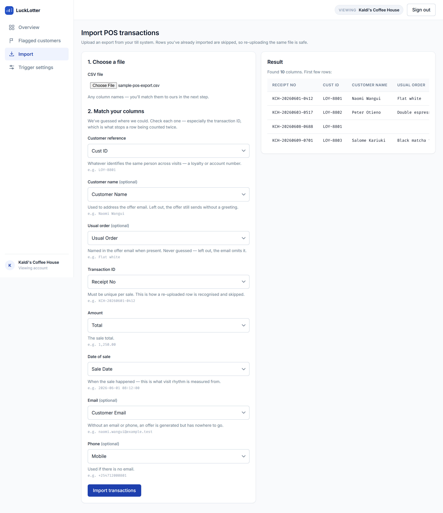

**Say:** "No two till vendors agree on column names, so we don't guess silently."

`docs/sample-pos-export.csv` uses a different vendor's headers — `Receipt No`,
`Cust ID`, `Sale Date`, `Total`. The importer reads the file server-side,
returns its real headers and sample rows, pre-fills a mapping, and makes the
admin confirm it. Each field shows a **live sample value from their own file**,
so they can verify rather than trust.

The transaction-ID column gets its own warning, because guessing it wrong is the
one mistake that breaks idempotency invisibly — and idempotency is what makes
re-uploading the same export safe. Import the file twice: the second run reports
25 duplicates and imports nothing.

---

## 4. Design decisions worth defending

### The interface explains itself in the domain's language

No screen shows a raw enum, a raw multiplier, or a raw error code as the primary
information. `SENDER_UNAVAILABLE` becomes *"The mail service was unavailable.
This will be retried."* — with the code kept in small print underneath, because
that is what support will ask for. The sentence is a translation, not a
replacement.

### Sidebar, decided against an earlier call

The app originally used a top nav, on the reasoning that four destinations don't
earn a permanent ~240px column and the flag table wants the width. That cost is
real and is now being paid. What changed is the judgement: a persistent left rail
reads as an **operations tool** rather than a settings page, and it gives the
tenant identity a fixed home instead of competing with navigation across the top.

The supplied mockups showed a sidebar **and** a top nav carrying the same four
destinations. The duplicate was deliberately not implemented — two copies of the
same navigation double where a user has to look and take back the vertical space
the sidebar just spent. The top strip keeps only what is about the *session*:
which business is on screen, and how to leave.

### Tenant context is a control, not a subtitle

"Viewing Kaldi's Coffee House" is a bordered chip next to Sign out — the control
that changes it — rather than a caption under the product name. Every number on
every screen is scoped to that business, so which business it is has to be a
fact you cannot miss.

### Success is a toast; failure is not

Saving settings raises an auto-dismissing toast. Save *failures* deliberately
stay as inline banners: a message the admin has to act on should never clear
itself on a timer. The toast host is mounted once in the shell as an
always-present `aria-live` region, so the announcement is reliable rather than
racing the element's own insertion.

### Responsive by degradation, not by hiding

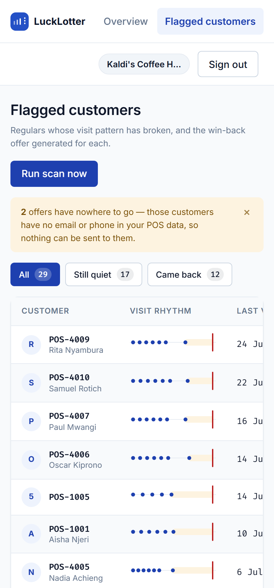

At ≤900px the rail becomes a horizontal scroller — costing height rather than
half the viewport — and the flag table scrolls sideways with the customer column
readable. At ≤560px the tenant chip sheds its label but keeps the name. Nothing
is removed at small sizes; it is re-laid-out.

On a tablet the rail moves to the top strip and the content takes the full
width — the stat row and the two analysis panels keep their shape rather than
being squeezed:

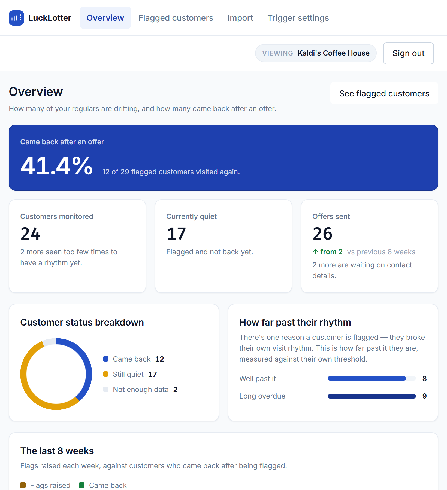

### The logo is the product's own behaviour

An even rhythm, one beat missing, and a dashed marker where the gap was noticed.
It is the only thing the system does, drawn at 28px.

---

## 5. Edge cases

This is the section most worth a reviewer's attention. Each of these is a real
decision with a real consequence, and each is enforced somewhere specific.

| # | Situation | What happens | Enforced by |
|---|---|---|---|
| 1 | Same POS transaction sent twice | No-op, reported as a duplicate | Unique `(business_id, external_txn_id)` |
| 2 | One visit rung up as three receipts | Counted as **one** visit | `MIN_VISIT_GAP = 6h` |
| 3 | Customer with no email or phone | Offer generated, marked `NO_CONTACT` | `Offer.markNoContact()` |
| 4 | Mail server down | `FAILED` with a retriable code; flag survives | `OfferSendService`, `REQUIRES_NEW` |
| 5 | Two scans overlapping | At most one open flag per customer | Partial unique index |
| 6 | Backdated transaction imported | Does **not** close an open flag | `IngestionService.resolveOpenFlag` |
| 7 | Customer lapsing on purpose | Cooldown, scaled to their own rhythm | `Business.cooldownDaysFor` |
| 8 | Programme costs more than planned | `SUPPRESSED_BUDGET`, still visible | Row lock + rolling window count |
| 9 | Too little history to judge | Never flagged, counted separately | `MIN_TRANSACTIONS = 3` |
| 10 | Another business's flag ID | 404, not 403 | `findByIdAndBusinessId` |
| 11 | Third-party error text in logs | Scrubbed | `Redact.scrub` |
| 12 | Unknown URL | 404, not 500 | `NoResourceFoundException` handler |

### 1. The same transaction arrives twice

A POS integration retries. Replaying a transaction is a **no-op, not a second
visit** — the ingest endpoint detects it and returns `"duplicate": true` without
writing anything. If two identical requests race, the unique constraint catches
the second and it answers `409`, not `500`.

This matters more than it sounds: a duplicated row would shorten the customer's
learned cadence, which drags their flag threshold down and wins them an offer
sooner than their real rhythm justifies.

### 2. A split bill is one visit, not three

A POS export is a list of *sales*, not a list of *trips to the counter*. One
visit routinely arrives as several rows — a split bill, items rung up
separately, a till that exports line items.

Transactions within **six hours** of each other are collapsed into one visit
before anything is measured, including the three-visit minimum. So three
receipts from a customer's first and only visit is still *no cadence*, rather
than a very short one.

Six hours separates "paid in three goes at one counter" from "came back later in
the day", which is a real second visit and must survive. It is also a floor on
the average, so the cadence can never round to zero.

> This is both the commonest accident on honest data **and** the cheapest way to
> game the trigger on purpose.

### 3. A customer with no contact details

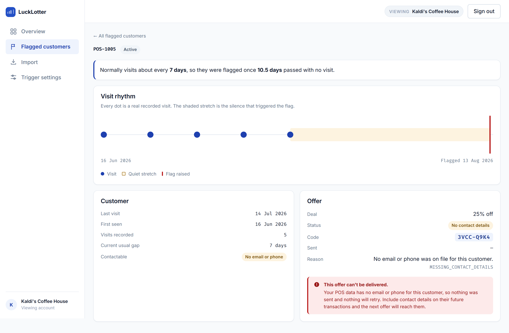

The customer really did lapse, so the flag is real. But there is nothing to send
to. The offer is **still generated and still shown**, marked `NO_CONTACT` — a
fourth status that exists precisely so this customer is visibly un-contactable
rather than sitting in `PENDING` forever.

`NO_CONTACT` is terminal and never retried: retrying would mean attempting to
send to a customer with nothing to send to. The count is surfaced on the flag
list as an amber banner, because it measures something the business can fix —
how much of their POS data lacks contact details.

### 4. The mail server is down

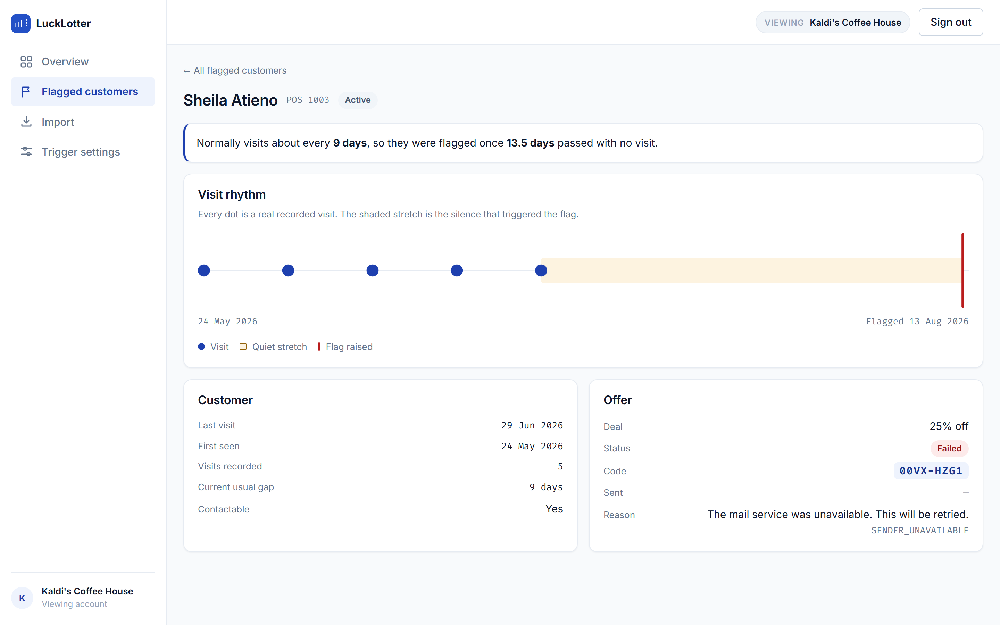

Sending happens **outside** the transaction that created the flag. A delivery
failure records itself on the offer and must not undo the flag — the customer
still lapsed whether or not the email got out.

Each attempt runs in its own transaction, so one customer's failed delivery
leaves the others sent. The provider's diagnosis goes to the log only,
correlated by offer ID, and is **scrubbed on the way in**: an SMTP rejection
routinely quotes the recipient's address back at us.

The stored `failure_code` is a bounded enum with a `CHECK` constraint behind it,
never a provider error string. A freeform message is how a phone number ends up
in a column that was never supposed to carry PII.

### 5. Two scans running at once

The scheduled 02:00 job and a manual **Run scan now** can overlap. Safety does
not come from the loop:

- Each customer is flagged in its **own** transaction, so one customer hitting
  the "already flagged" constraint doesn't roll back the whole sweep.
- The pre-check is a cheap optimisation. The thing that actually makes it safe
  is a **partial unique index** on active flags. When it fires, that is the
  constraint doing its job, not an error.
- One customer erroring cannot end the sweep; the scan counts it and continues.

### 6. A backdated transaction must not close a flag

Any new transaction resolving an open flag is right for live POS traffic and
**wrong for a historical CSV backfill**. Importing a year of history for a
customer who is currently lapsed would close their flag on the strength of a
sale from months ago — reporting them as recovered when nobody has seen them.
Worse, it would do it silently and in bulk: one import could clear a whole
dashboard.

So only a transaction that moves the customer's last-visit date forward can
answer the flag. The same condition governs both, which is why they cannot drift
apart.

### 7. The retention loop must not pay out indefinitely

A resolved flag makes a customer immediately re-flaggable. Without a cooldown,
the cycle *go quiet → collect a discount → return → go quiet again* repeats
forever, training regulars to space their visits out to harvest offers — the
exact opposite of what the product is for.

The cooldown is scaled to the customer's own rhythm, for the same reason the
threshold is: a month of silence is a lapse for a weekly regular and
unremarkable for someone who visits twice a year. A customer inside their
cooldown is not a failure and not an anomaly, so it is logged at debug and
counted as skipped.

### 8. The programme costs more than the owner planned

The cooldown bounds what *one customer* can extract. It says nothing about total
spend, which is the number a business actually cares about — so there is a
separate rolling ceiling on offers per window.

Two design choices here are worth pointing out:

- The **flag is still created** when the budget is spent. Hiding the customer
  because the money ran out would read as healthy retention rather than as
  exhausted spend. The offer is marked `SUPPRESSED_BUDGET` and stays on the
  dashboard, and the count of them is the evidence for raising the cap.
- The count-then-insert is guarded by a **row lock on the business**, taken
  before the count. Without it, two overlapping scans both read a count under
  the cap and both insert.

> That lock was verified by **removing** it and watching all 16 concurrent
> callers get an offer against a cap of 5. A sequential test would have passed
> either way — which is the point.

### 9. Not enough history to judge

Two visits give one interval, which is not enough to call a rhythm. Below three
visits a customer has **no cadence and is never flagged** — a fixed constant, not
per-business config, with no exceptions in Phase 1.

These customers are not hidden. The overview counts them separately as *"seen
too few times to have a rhythm yet"*, so coverage is never overstated.

### 10. Another business's data

Every query takes `businessId` from the authenticated principal and filters on
it — including the single-flag lookup. `/v1/transactions` treats the
`businessId` in its payload as an assertion to *check*, never as an instruction
to obey, and refuses a mismatch.

A flag belonging to another business reads as **404, not 403**, so the API never
confirms that someone else's row exists.

### 11. Contact details must not reach the logs

Third-party error text is the leak nobody plans for. An SMTP rejection quotes
the recipient; Postgres quotes the offending key in a constraint violation, and
that key can be a customer's external reference; a malformed-payload error
quotes the payload, and an ingest payload carries contact details.

All of it goes through `Redact.scrub` / `scrubStackTrace` before it is logged —
rendered and scrubbed rather than handed to the logger, which would otherwise
print the message verbatim above the frames.

### 12. A mistyped URL

Spring raises `NoResourceFoundException` from the static-resource handler.
Without an explicit case it falls through to the catch-all and a mistyped path
answers **500** — telling the caller the server broke when the request was simply
wrong, and putting routine 404s into the error log where a real fault becomes
harder to see.

---

## 6. How this is verified

`63 tests, 0 failures` as of 18 August 2026.

Persistence tests run against **real Postgres via Testcontainers with Flyway
applied — never H2**, because the partial unique index and the offer `CHECK`
constraints are precisely what a substitute database would not enforce.

| Suite | Covers |
|---|---|
| `CadenceCalculatorTest` | visit collapsing, the three-visit minimum, order-insensitivity |
| `FlagCreationServiceTest` | the seam where cooldown, budget and contactability meet |
| `FlagCreationConcurrencyTest` | the budget lock under 16 concurrent callers |
| `IngestionBackdatingTest` | backdated transactions not closing flags |
| `OfferBudgetCeilingTest`, `OfferCooldownLookupTest` | the rolling window and cooldown queries |
| `RetentionFlagOfferMappingTest` | the constraints that carry design decisions |
| `RedactTest` | that scrubbing actually removes contact details |
| `ApiSecurityAndContractTest` | auth, tenant scoping, status codes, validation shape |
| `BusinessCooldownTest`, `CadenceRebuildServiceTest` | threshold/cooldown arithmetic and bulk re-derivation |

Run them with:

```bash
docker run --rm -v "$PWD/backend:/app" -v lucklotter_m2:/root/.m2 \
  -v /var/run/docker.sock:/var/run/docker.sock \
  -e TESTCONTAINERS_HOST_OVERRIDE=host.docker.internal \
  -w /app maven:3.9-eclipse-temurin-21 mvn -B test
```

---

## 7. What is deliberately not built yet

Being straight about this is worth more than a longer feature list.

- **A live mail provider.** The SMTP path is real end to end, but it points at
  Mailpit. Switching over is `MAIL_HOST` / `MAIL_PORT` / `MAIL_AUTH` plus
  credentials.
- **SMS.** A phone-only customer lands at `FAILED` with a *retriable* code
  rather than a false `SENT`, so a sender added later picks those offers up
  without a migration.
- **Redemption tracking.** Offers carry a unique code; nothing marks one as
  used. That is Phase 2.
- **A no-PII audit against a live POS feed.** Scrubbing is in place and tested;
  it has never been run against data that actually carries emails and phone
  numbers.
- **Gamification** — the spin/voucher product — is Phase 2 and out of scope
  here.

### One known limitation to name before someone finds it

The learned cadence is a mean over the customer's **whole** history. A customer
whose rhythm genuinely changed — weekly for a year, then monthly — reads as
something in between, and will be flagged later than they should be. A trailing
window would track a changing rhythm better. This is a known open question, not
an oversight.
